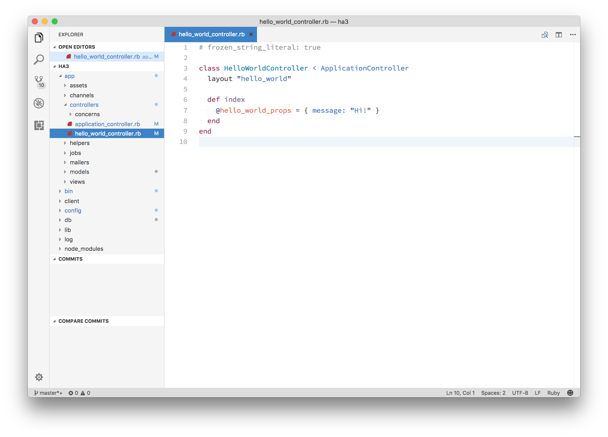

# PRIMER-LIGHT
## A VS Code port of the Primer theme from Sublime Text
Primer is a light theme based on GitHub's UI and design guidelines.

# Installation
1. Open **Extensions** sidebar panel in VS Code. `View → Extensions`
2. Search for `Primer Light`
3. Click **Install** to install it.
4. Click **Reload** to reload the your editor
5. Code > Preferences > Color Theme > **Primer Light**
6. Optional: Use the recommended settings below for best experience

### Contributing
This is very much a work in progress with lots of issues left to resolve. PRs are more than welcome if you want to help out!

### Thanks
* Many many thanks to [Karel Vuong](https://github.com/karelvuong) for designing the best light theme out there!
* You can find the original theme for sublime text [here](https://github.com/karelvuong/st-primer).
